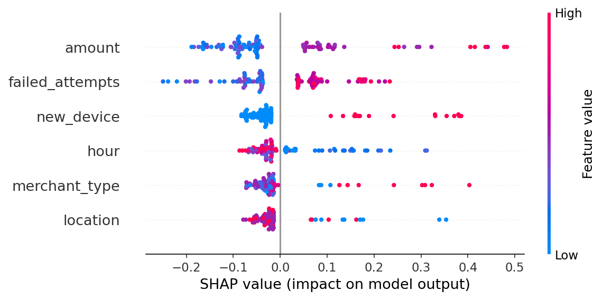

# 🔍 UPI Fraud Transaction Detector

A few months ago, my grandfather lost ₹1,00,000 in a UPI fraud. 
Someone called him pretending to be a bank official and got him 
to transfer the money himself. When we approached the bank, 
they said the transaction was "flagged as suspicious" — but 
nobody could explain *why* it wasn't stopped, or *what* made 
it suspicious in the first place.

That incident made me want to build something that doesn't 
just detect fraud — but actually **explains** the decision.
This project is that attempt.

---

## 🚀 What It Does

- Analyzes a UPI transaction in real-time
- Predicts whether it's **Fraudulent or Legitimate** with a confidence score
- Shows a **SHAP explanation chart** — exactly which factors triggered the fraud alert
- Built entirely in Python with a clean web interface

---

## 📊 Model Performance

| Metric | Score |
|--------|-------|
| Accuracy | 98% |
| Fraud Precision | 100% |
| Fraud Recall | 89% |

---

## 🧠 The Explainability Angle

Most fraud detectors are black boxes — they say "fraud" but 
don't say why. I used **SHAP (SHapley Additive exPlanations)** 
to make the model transparent. Every prediction comes with a 
waterfall chart showing which features pushed the decision 
toward fraud or legitimate.

This matters because in real fintech systems, explainability 
isn't optional — it's a regulatory and trust requirement.

---

## 🛠️ Tech Stack

| Tool | Purpose |
|------|---------|
| Python | Core language |
| Scikit-learn | Random Forest classifier |
| SHAP | Explainable AI |
| Streamlit | Web interface |
| Pandas | Data processing |

---

## ▶️ Run Locally

git clone https://github.com/Anjali-dot-AI/UPI-fraud-detector.git
cd UPI-fraud-detector
pip install -r requirements.txt
python generate_data.py
python train_model.py
python -m streamlit run app.py

---

## 📸 Demo

**Fraud Case** — Late night, crypto merchant, foreign location, new device:

---

*Built with a lot of frustration, some pandas, and the hope that 
nobody else's grandfather has to go through what mine did.*
